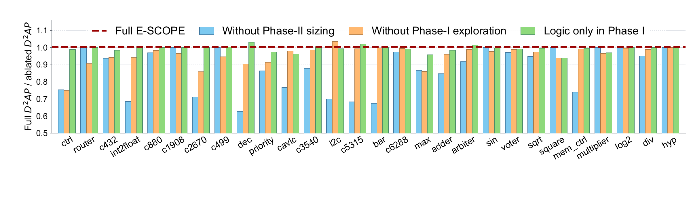

# Phase ablation

Each benchmark uses the Iterative or Conquer method used for its full-method
comparison, as recorded in `manifest.json`. The three modes are:

- `phase1-only`: exploration without Phase-II sizing.
- `phase2-only`: sizing without Phase-I exploration.
- `no-pi-drive-expansion`: logic-only exploration in Phase I.



Paper Fig. 8: D²AP(full) / D²AP(ablated) for the three ablations;
values below 1 favor full E-SCOPE. [View the vector PDF](figures/ablation.pdf).

Build the shared binaries using the [root README](../../README.md), then run
one ablation:

```bash
python3 experiments/ablation/run.py run-one \
  --benchmark c432 --mode phase1-only \
  --output /tmp/ablation-c432 \
  --liberty /path/to/asap7_full_comb.lib \
  --bin-dir /tmp/escope-build/release
```

Run all 84 benchmark/mode combinations:

```bash
python3 experiments/ablation/run.py run-all \
  --output /tmp/ablation-all \
  --liberty /path/to/asap7_full_comb.lib \
  --bin-dir /tmp/escope-build/release
```

Each task writes `status.json` and a `search/` directory. After the searches,
evaluate them against completed full-method runs:

```bash
python3 experiments/ablation/run.py finalize \
  --output /tmp/ablation-all \
  --full-results /tmp/main28-all \
  --liberty /path/to/asap7_full_comb.lib \
  --genus-bin /path/to/genus \
  --yosys-bin /path/to/yosys --abc-bin /path/to/abc
```

The entry freezes the candidate pool, measures G0, full and ablated netlists
with Genus, checks equivalence, and writes:

- `results/ppa.csv`: selected candidates, delay, area, power and netlist paths.
- `results/ablation.csv`: the three `D²AP(full) / D²AP(ablated)` ratios per case.
- `results/summary.json`: geometric means of those ratios.

Iterative uses the lowest external D²AP among its accepted checkpoints.
Conquer Phase I uses the pre-sizing counterpart of the supplied full result
(`NORMAL_POST` maps to `NORMAL_PRE`; other atomic candidates retain their ID).
Conquer Phase II uses its one-round sizing result. The Conquer no-drive mode
chooses the lowest external D²AP from its finalist pool and G0.

Full and ablated runs must use the same method and G0. `--full-results` reads
the selected netlist and receipt from the main experiment; a method mismatch
is reported before evaluation. To evaluate a single case, add `--benchmark`
and provide a directory containing that case's three mode subdirectories
under `<benchmark>/`. `--full-results` also accepts a single completed main
run. Repeat the same command to reuse completed Genus and formal evaluations.
